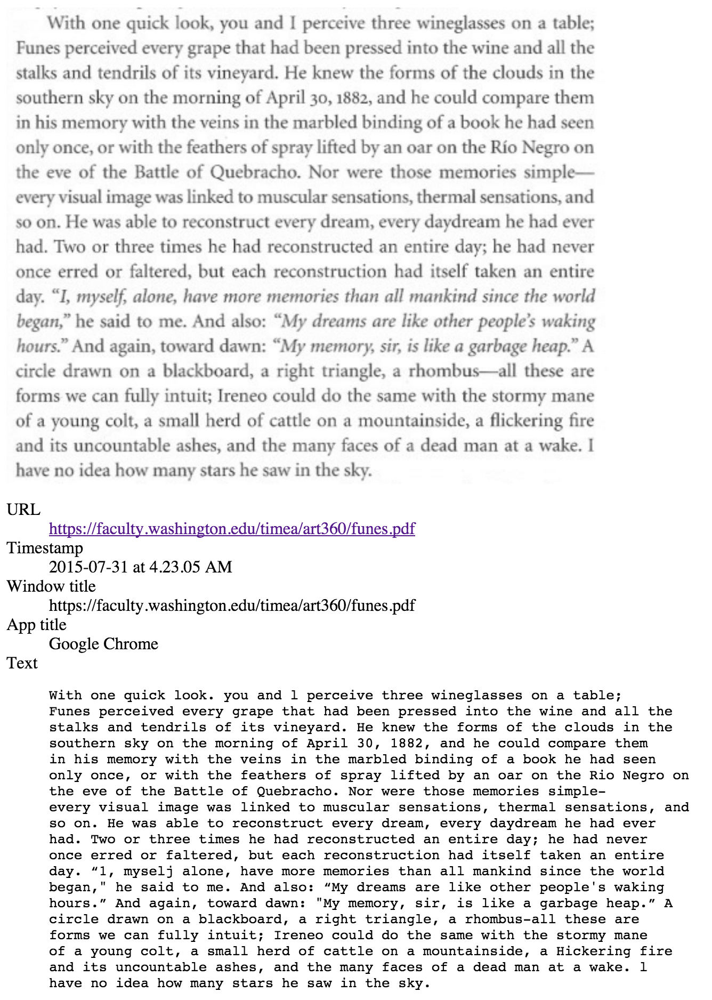

# Screenotate

Screenotate is a tool by [Omar Rizwan](https://rsnous.com) for taking
annotated screenshots on Mac OS X.

1. Take a screenshot almost exactly as you always have: press a key
   shortcut (Cmd-Shift-5 by default) and then drag out a region.

2. Then Screenotate automatically figures out what app and window
   you're in, what Web page the content comes from (if applicable),
   and OCRs the text in the screenshot to make it searchable
   later.

   All this information is embedded in the screenshot, which is
   stored as an HTML file with the image as a data-URI inside.

3. The screenshot is sent to your Desktop by default, but you can set
   up a Dropbox account in Preferences so that shared links are copied
   to the Clipboard.

You may find it useful for snipping paragraphs or phrases out of Web
pages -- if your screenshots are automatically annotated, you don't
need to trawl through them later and try to figure out where they come
from.

## Notes, warnings, and known issues

- OCR will not work properly on screenshots from non-Retina
  displays. They just don't have high enough resolution.

- Install and enable the
[MozRepl extension](https://github.com/bard/mozrepl/wiki) if you want
Screenotate to capture URLs from Firefox. (This feature is
experimental.)

- The app only considers the window containing the top-left corner of
your selected region when it looks for metadata.

- Though Screenotate can detect the window *title* for any window
  (active or inactive), its URL detection is not as solid: if you take
  a screenshot from *any* browser window, it will capture the URL of the
  *frontmost window* of that browser.

  (So Screenotate may leak your information -- read over your
  screenshots before sharing to be sure nothing gets out.)

- Your frontmost window will temporarily lose focus as you select the
  screenshot region, but don't worry: in the actual screenshot, it
  will appear focused.

- Upload to Dropbox is slow, and the link isn't copied until the
upload finishes.

- Some windows, including Emacs', give us blank titles for some
  reason.

## Building tips

Remember to initialize the submodules.

Tesseract needs to be built as a static library, and it needs
leptonica, libpng, and a bunch of other libraries; the process is
somewhat tricky.

## License

Screenotate is licensed under the [GNU General Public License, version
3.0](LICENSE.txt).
